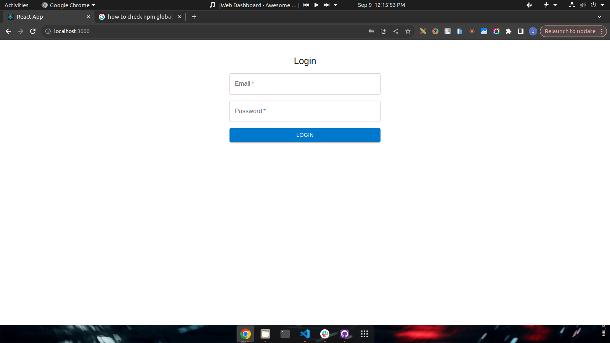
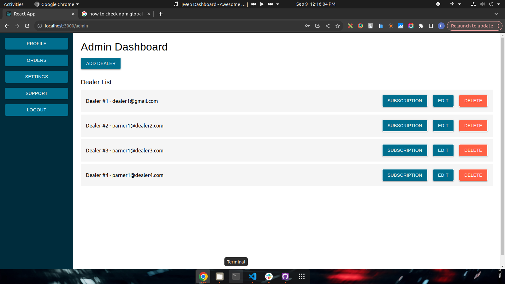
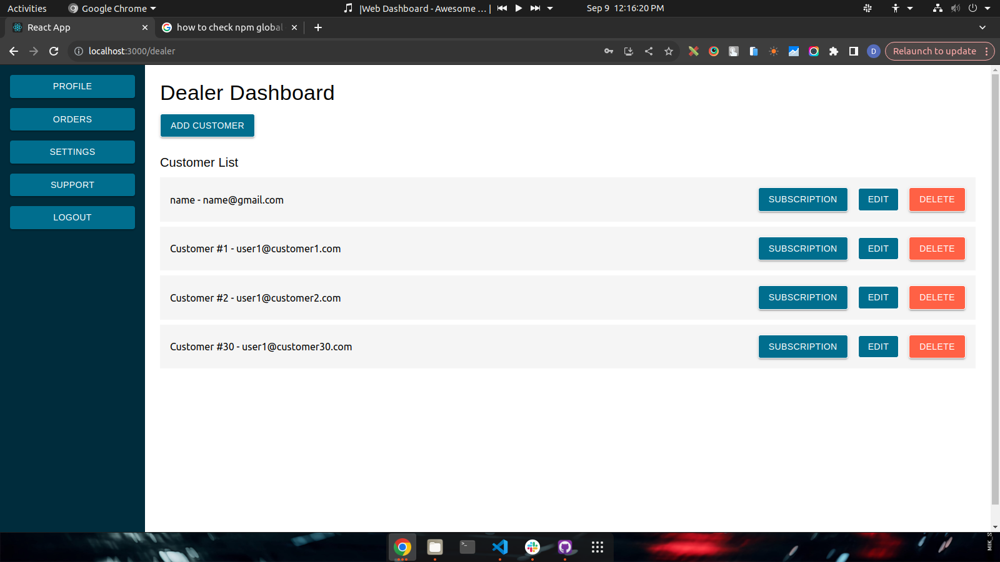
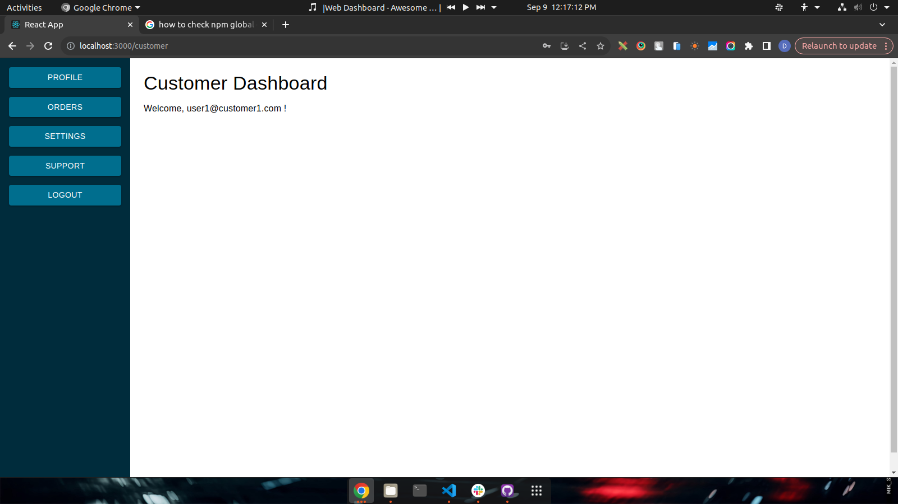

# Web Dashboard (React-Node-Firebase-Auth)

## Description

This project is a **Web Dashboard** built using React for the front end and Node.js for the back end. It features Firebase Authentication for secure login and user management. The app allows dealers to manage their customers, update details, and subscribe to services, all within a responsive and user-friendly dashboard interface.

## Features

- User Authentication with Firebase
- Admin Dashboard for managing dealers
- Dealer Dashboard for managing customers
- CRUD operations (Create, Read, Update, Delete) for both dealers and customers
- Subscription management for customers
- Responsive and intuitive UI built using React
- Role-based access control (Admin, Dealer, Customer)

## Screenshots

### Login Page

### Admin Dashboard

### Dealer Dashboard

### Customer Dashboard

## Tech Stack

- **Frontend**: React.js, MUI
- **Backend**: Node.js, Express.js
- **Database**: Firebase Firestore Database
- **Authentication**: Firebase Auth

## Installation

### Prerequisites

Make sure you have the following installed:

- Node.js (>= 20.x)
- Firebase CLI
- Git
